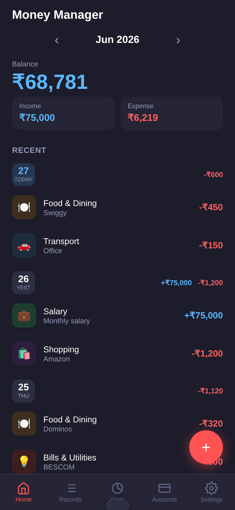
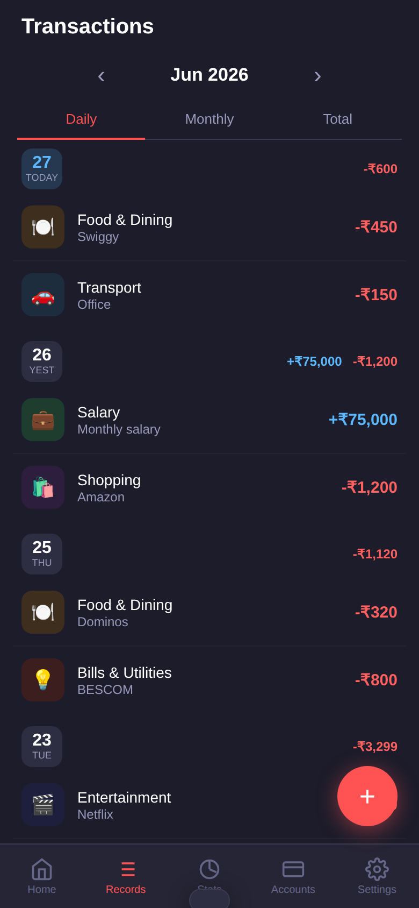
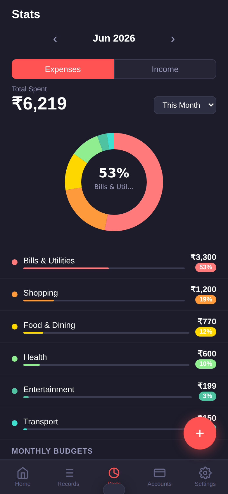
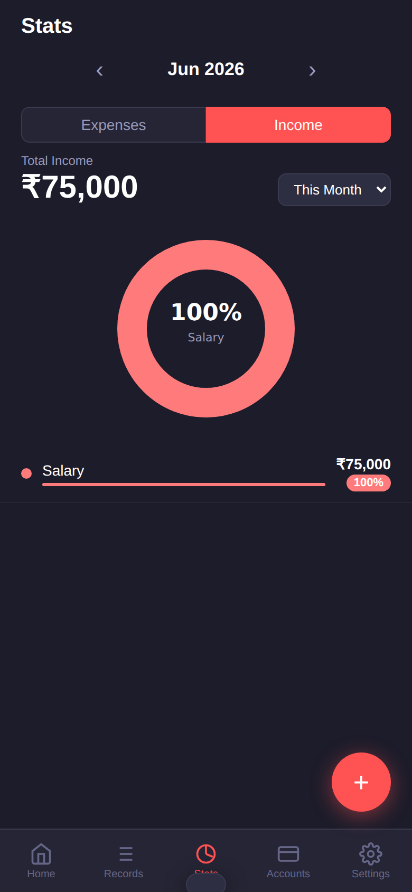
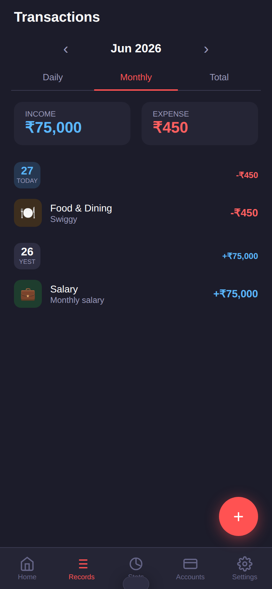
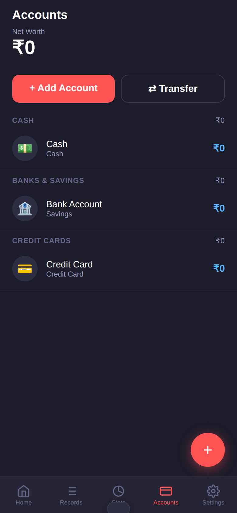
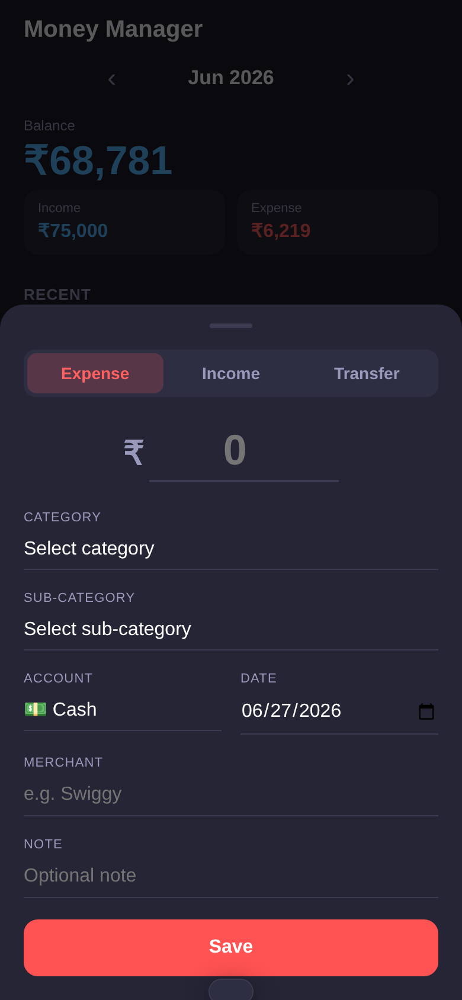
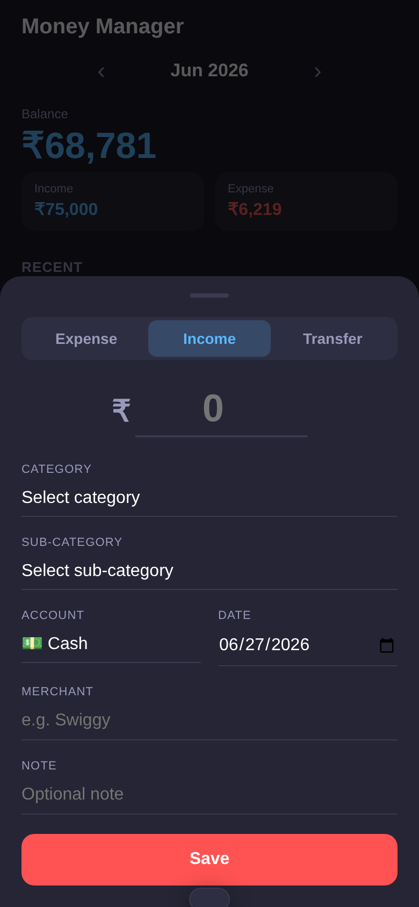
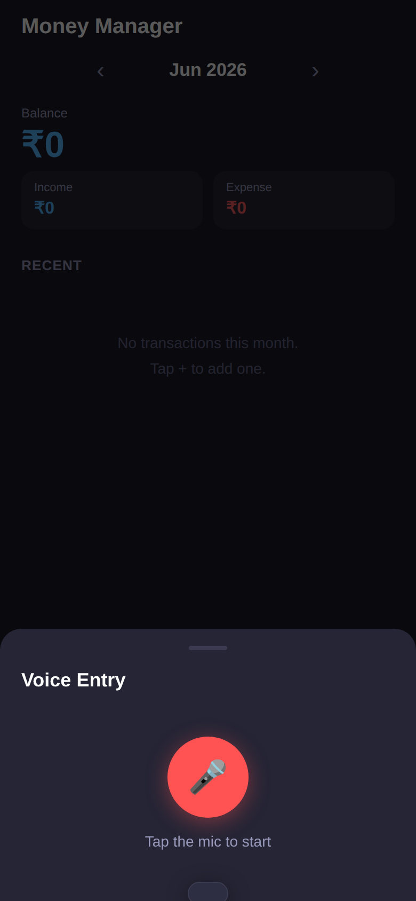
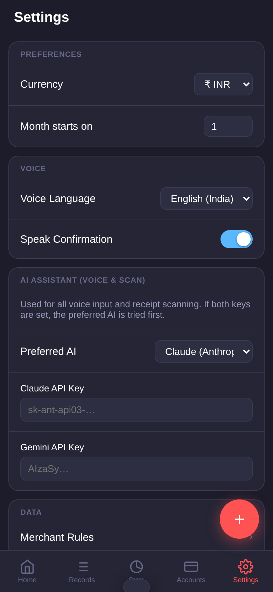

# Money Manager

A zero-build, offline-first PWA for tracking personal expenses. All data stays on your device (IndexedDB) — no account, no server, no cloud sync.

---

## Screenshots

<table>
  <tr>
    <td align="center"><b>Home</b></td>
    <td align="center"><b>Transactions</b></td>
    <td align="center"><b>Stats — Expenses</b></td>
  </tr>
  <tr>
    <td></td>
    <td></td>
    <td></td>
  </tr>
  <tr>
    <td align="center"><b>Stats — Income</b></td>
    <td align="center"><b>Monthly View</b></td>
    <td align="center"><b>Accounts</b></td>
  </tr>
  <tr>
    <td></td>
    <td></td>
    <td></td>
  </tr>
  <tr>
    <td align="center"><b>Add Expense</b></td>
    <td align="center"><b>Add Income</b></td>
    <td align="center"><b>Voice Entry</b></td>
  </tr>
  <tr>
    <td></td>
    <td></td>
    <td></td>
  </tr>
  <tr>
    <td align="center" colspan="3"><b>Settings</b></td>
  </tr>
  <tr>
    <td colspan="3" align="center"></td>
  </tr>
</table>

---

## Features

### Core
- **Manual entry** — expense, income, or transfer with category, sub-category, account, date, merchant, and note
- **Voice entry** — speak your transaction naturally ("paid 450 on Swiggy"); AI extracts amount, merchant, category, and date
- **Receipt scan** — photograph a bill and AI reads the amount, merchant, and date automatically
- **Multi-transaction voice** — say multiple transactions in one go ("spent 200 on groceries and 150 on uber") and the app saves them all

### Transaction List
- Day-grouped view with day number badges (red = Sunday, blue = Saturday)
- Per-day income and expense totals shown in each group header
- Three view modes: **Daily**, **Monthly** (with summary cards), **Total** (balance summary)
- Month navigation — browse any past or future month with `‹ Jun 2026 ›`

### Stats
- **Expenses / Income** tab toggle
- SVG donut pie chart — top category shown in the centre with its percentage
- Category rows with coloured progress bars and % badges matching the pie slices
- **Monthly budgets** — set a spend limit per category; bar turns red when over budget
- Period selector: This Month, Last Month, This Year, All Time

### Accounts
- Grouped by Cash, Banks & Savings, Credit Cards, Investments
- Net worth total at the top
- Transfers between accounts with balance update on both sides

### AI Assistant (Voice & Scan)
- Supports **Claude (Anthropic)** and **Gemini (Google)** — set one or both API keys
- Preferred AI is tried first; the other is automatic fallback
- Falls back to built-in keyword NLP if no API key is configured
- 50+ Indian merchant keywords built-in (Swiggy, Zomato, Uber, Amazon, Airtel, etc.)

### Other
- Merchant memory — the app remembers which category a merchant belongs to and pre-fills it next time
- JSON export of all data
- Offline-first — works with no internet after the first load (Service Worker cache)
- Installable as a PWA on Android, iOS, and desktop

---

## Running locally

The app is plain HTML/JS with no build step. Just serve the folder over HTTP.

**Option 1 — Python (no install needed)**
```bash
cd money-manager
python3 -m http.server 3000
```
Open `http://localhost:3000`.

**Option 2 — Node.js**
```bash
npx serve .
```

**Option 3 — VS Code**
Install the [Live Server](https://marketplace.visualstudio.com/items?itemName=ritwickdey.LiveServer) extension → right-click `index.html` → Open with Live Server.

> The app must be served over HTTP (not opened as a `file://` URL) for IndexedDB and the Service Worker to work.

---

## Installing on Android

1. Deploy to a public URL (GitHub Pages, Netlify, etc.) **or** serve locally and connect your phone to the same Wi-Fi
2. Open the URL in **Chrome on Android**
3. Tap the 3-dot menu → **Add to Home Screen**
4. The app is now installed and works fully offline — the server does not need to stay running

### Quickest free deployment — GitHub Pages
1. Go to your repo → **Settings → Pages**
2. Set source to the branch containing this code, folder `/` (root)
3. GitHub gives you a URL like `https://username.github.io/money-manager`
4. Open that on your phone → Add to Home Screen

---

## AI setup

Go to **Settings → AI Assistant** and paste your API key(s).

| Provider | Where to get a key | Format |
|---|---|---|
| Claude (Anthropic) | [console.anthropic.com](https://console.anthropic.com) | `sk-ant-api03-…` |
| Gemini (Google) | [aistudio.google.com](https://aistudio.google.com) | `AIzaSy…` |

- Set **Preferred AI** to whichever you want used first
- If both keys are set, the preferred provider is tried; the other is fallback
- If no key is set, voice and scan still work using built-in keyword matching

Models used: `claude-haiku-4-5` (Anthropic) · `gemini-2.5-flash` (Google)

---

## Project files

| File | Purpose |
|---|---|
| `index.html` | UI shell + all CSS (dark theme) |
| `app.js` | Business logic, voice NLP, Claude & Gemini API integration |
| `database.js` | Dexie/IndexedDB schema + default seed data |
| `sw.js` | Service Worker — cache-first offline strategy |
| `dexie.min.js` | Dexie v3.2.4 bundled locally (no CDN dependency) |
| `manifest.json` | PWA manifest |
| `icons/` | App icons — 192 px and 512 px |
| `screenshots/` | App screenshots used in this README |
